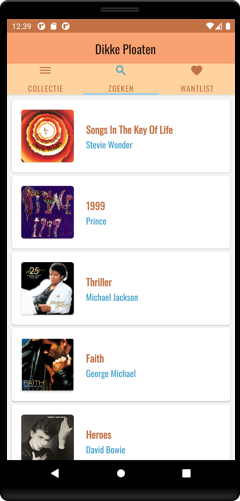
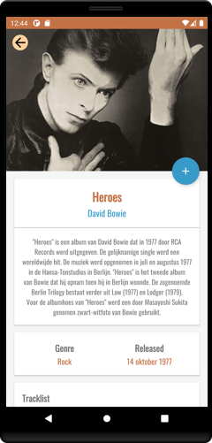
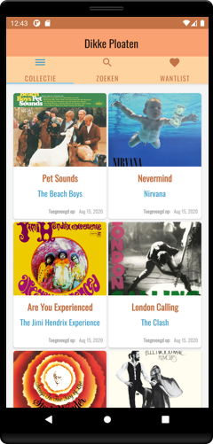

# Dikke Ploaten - Android Application

Welcome to the Android version of the 'Dikke Ploaten'-app. This application is specially made for the diehard music fans who want to keep track of their music collection. You simply install the app and start organizing your vinyls or cd's! You'll be able to add albums to your collection or wantlist. It is also possible to discover new albums you've never heard of. For this, we implemented an information screen of each album. 

Have a look and become a new member of the 'Dikke Ploaten'-community!

__This application features:__
* An interface fully in Dutch.
* View Pager with tabs for a better user experience.
* Collection tab to manage your collected albums.
* A Wantlist to keep track of the albums you desire.
* Search page with a whole list of albums.
* A Detail page of each album.
* Buttons to add or remove an album to/from your collection, wantlist.
* Animations on widgets and between screens.
* Different screen layouts for portrait and landscape mode.

## Getting Started

These instructions will get you a copy of the project up and running on your local machine for development and testing purposes.

### Prerequisites

What things you need to install the software:

* Android Studio

### Installing

1. Clone this repository.
2. Install Android Studio.
3. Open Android Studio, click `Open an existing Android
   Studio project` and select the project. Gradle will build the project.
3. Open Android Studio and import the project.
4. Run the app. Click `Run > Run 'app'`. After the project builds you'll be
   prompted to build or launch an emulator.
   
#### Running the unit tests

1. Go to Android Studio.
2. Go to a specific test class.
3. Run the test by clicking on the green arrow, your test will run automatically.

## Screenshots

## Libraries Used

* [Foundation][0] - Components for core system capabilities, Kotlin extensions and support for
  multidex and automated testing.
  * [AppCompat][1] - Degrade gracefully on older versions of Android.
  * [Android KTX][2] - Write more concise, idiomatic Kotlin code.
* [Architecture][10] - A collection of libraries that help you design robust, testable, and
  maintainable apps. Start with classes for managing your UI component lifecycle and handling data
  persistence.
  * [Data Binding][11] - Declaratively bind observable data to UI elements.
  * [Lifecycles][12] - Create a UI that automatically responds to lifecycle events.
  * [LiveData][13] - Build data objects that notify views when the underlying database changes.
  * [Navigation][14] - Handle everything needed for in-app navigation.
  * [Room][16] - Access your app's SQLite database with in-app objects and compile-time checks.
  * [Retrofit][18] - For fetching data of the Internet using HTTP request calls.
  * [ViewModel][17] - Store UI-related data that isn't destroyed on app rotations. Easily schedule
     asynchronous tasks for optimal execution.
* [UI][30] - Details on why and how to use UI Components in your apps - together or separate
  * [Animations & Transitions][31] - Move widgets and transition between screens.
  * [Fragment][34] - A basic unit of composable UI.
  * [Layout][35] - Lay out widgets using different algorithms.
* Third party
  * [Glide][90] for image loading
  * [MockK][4] - Open Source mocking library for Kotlin for unit and runtime UI tests.
  * [Moshi][92] makes it easy to parse JSON into Java objects
  * [Kotlin Coroutines][91] for managing background threads with simplified code and reducing needs for callbacks.
  * [Ktlint][93] for improving code quality and clean code

[0]: https://developer.android.com/jetpack/components
[1]: https://developer.android.com/topic/libraries/support-library/packages#v7-appcompat
[2]: https://developer.android.com/kotlin/ktx
[4]: https://mockk.io/
[10]: https://developer.android.com/jetpack/arch/
[11]: https://developer.android.com/topic/libraries/data-binding/
[12]: https://developer.android.com/topic/libraries/architecture/lifecycle
[13]: https://developer.android.com/topic/libraries/architecture/livedata
[14]: https://developer.android.com/topic/libraries/architecture/navigation/
[16]: https://developer.android.com/topic/libraries/architecture/room
[17]: https://developer.android.com/topic/libraries/architecture/viewmodel
[18]: https://square.github.io/retrofit/
[30]: https://developer.android.com/guide/topics/ui
[31]: https://developer.android.com/training/animation/
[34]: https://developer.android.com/guide/components/fragments
[35]: https://developer.android.com/guide/topics/ui/declaring-layout
[90]: https://bumptech.github.io/glide/
[91]: https://kotlinlang.org/docs/reference/coroutines-overview.html
[92]: https://github.com/square/moshi
[93]: https://github.com/pinterest/ktlint

## Documentation

We used [dokka](https://github.com/Kotlin/dokka) for documentation of the project.
The docs are available under the folder ['doc'](https://github.com/VictorVanhove/Dikke-Ploaten-Android/tree/master/app/doc/app) inside each module.

## Contributors

This app is brought to you by **Victor Vanhove**.
